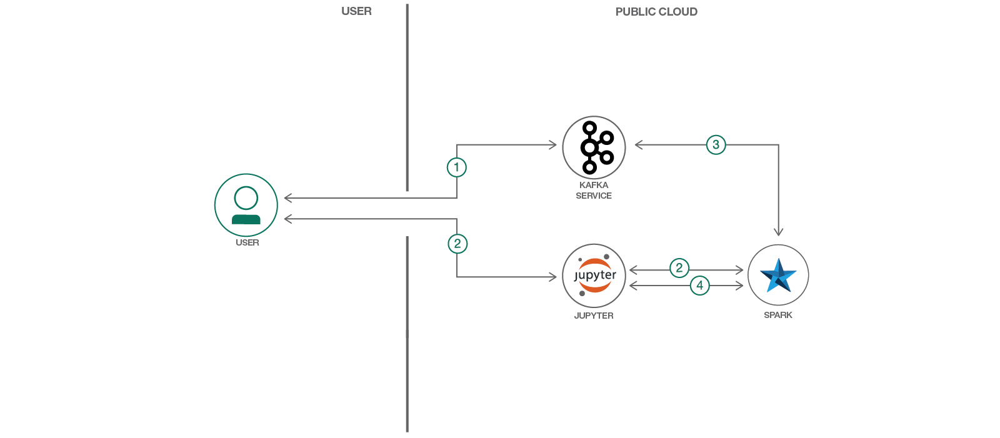

*阅读本文的其他语言版本：[English](README.md)。*

# 使用 Apache Spark 和 Apache Kafka 的点击流分析

> Data Science Experience 现在更名为 Watson Studio。尽管本 Code Pattern 显示的一些图片还是 Data Science Experience，但步骤和过程依旧是有效的。

点击流分析是收集、分析和报告用户访问了哪些网页的过程，可以提供有关网站使用特征的有用信息。

点击流分析的一些流行用例包括：

* **A/B 测试：** 统计分析从版本 A 更改到 B 对网站的用户有何影响。[了解更多](https://en.wikipedia.org/wiki/A/B_testing)

* **在购物门户网站上生成推荐：** 购物门户网站用户的点击模式表明了用户是受何种影响才购买某款商品的。此信息可用来为未来的类似点击模式生成推荐。

* **针对性广告：** 类似于*推荐生成*，但跟踪用户的“跨网站”点击，并利用该信息实时投放广告。

* **热门主题：** 可使用点击流来实时分析或报告热门主题。对于某个特定的时间段，显示用户点击次数最多的热门项目。

在本 Code Pattern 中，我们将演示如何检测 [Wikipedia](https://www.wikipedia.org/) 网站上的实时热门主题。要执行此任务，将会使用 Apache Kafka 作为消息队列，使用 Apache Spark 结构化流引擎来执行分析。这种组合因其实用性、高吞吐量和低延迟特征而闻名。

完成此 Code Pattern 后，您将掌握如何：

* 使用 [Jupyter Notebook](http://jupyter.org/) 加载、可视化和分析数据。
* 在 [IBM Watson Studio](https://dataplatform.ibm.com/) 中使用 Notebook 以交互方式运行流分析
* 在 Spark Shell 上使用 Apache Spark Structured Streaming 以交互方式开发点击流分析
* 利用 Apache Kafka 构建一个低延迟处理流。



## 操作流程

1.用户连接 Apache Kafka 服务并设置一个点击流的运行实例。

2.在与基础 Apache Spark 服务交互的 IBM Data Science Experience 中运行 Jupyter Notebook。此操作也可以通过运行 Spark Shell 来在本地完成。

3.Spark 服务从 Kafka 服务读取并处理数据。

4.处理后的 Kafka 数据通过 Jupyter Notebook（如果在本地运行，则是通过控制台）转发回用户。 

## 包含的组件

* [IBM Watson Studio](https://www.ibm.com/cloud/watson-studio): 在配置好的、协作的环境中使用 RStudio、Jupyter 和 Python 分析数据，其中包括 IBM 增值服务，比如托管 Spark。
* [Apache Spark](http://spark.apache.org/)：一个允许执行大规模数据处理的开源、分布式计算框架。
* [Apache Kafka](http://kafka.apache.org)：Kafka 用于构建实时数据管道和流应用程序。它的设计是可水平扩展、容错和快速的。
* [Jupyter Notebook](http://jupyter.org/)：一种开源 Web 应用程序，允许创建并共享包含实时代码、等式、可视化和解释文本的文档。
* [Message Hub](https://console.ng.bluemix.net/catalog/services/message-hub)：一个可扩展、高吞吐量的消息总线，它使用开放协议将微服务联系在一起。

# 观看视频

[](http://v.youku.com/v_show/id_XMzUwODg1NzE4OA==.html)

# 步骤

练习本 Code Pattern 的两种模式：
* [在本地使用 Spark shell 运行](#run-locally)。
* [在 IBM Watson Studio 中使用 Jupyter Notebook 运行](#run-using-a-jupyter-notebook-in-the-ibm-data-science-experience)。*备注：在此模式下运行需要一个 [Message Hub](https://developer.ibm.com/messaging/message-hub/) 服务，该服务会收取少量费用。*

## 在本地运行
1.[安装 Spark 和 Kafka](#1-install-spark-and-kafka)

2.[设置并运行一个模拟的点击流](#2-setup-and-run-a-simulated-clickstream)

3.[运行脚本](#3-run-the-script)

### 1.安装 Spark 和 Kafka

从 [Apache Kafka](https://kafka.apache.org/downloads)（推荐版本为 0.10.2.1）和 [Apache Spark 2.2.0](https://spark.apache.org/releases/spark-release-2-2-0.html) 下载并提取一个二进制发行版到您系统上，以便进行安装。

### 2.设置并运行一个模拟的点击流

*备注：如果您已有一个点击流可供处理，可以跳过这些步骤。如果是这样，需要在执行下一步之前创建数据并将它们传输到名为“clicks”的主题。*

按照以下步骤设置一个使用来自外部发布者的数据的模拟点击流：

1.从[这里](https://meta.wikimedia.org/wiki/Research:Wikipedia_clickstream#Where_to_get_the_Data "Wikipedia clickstream data") 下载并提取 `Wikipedia Clickstream` 数据。因为此数据的模式在不断演变，所以您可以选择用于测试本 Code Pattern 的数据集 - `2017_01_en_clickstream.tsv.gz`。

2.按照[这里](http://kafka.apache.org/quickstart) 列出的操作说明，创建并运行一个本地 Kafka 服务实例。一定要创建一个名为 `clicks` 的主题。

3.Kafka 发行版包含一个方便的命令行实用程序，用于将数据上传到 Kafka 服务。要处理模拟的 Wikipedia 数据，可运行以下命令：

*备注：将 `ip:port` 替换为运行的 Kafka 服务的正确值，在本地运行时，该值默认为 `localhost:9092`。*

```
$ cd kafka_2.10-0.10.2.1
$ tail -200 data/2017_01_en_clickstream.tsv | bin/kafka-console-producer.sh --broker-list ip:port --topic clicks --producer.config=config/producer.properties
```

*提示：Unix head 或 tail 实用程序可用于方便地指定要发送的用来模拟点击流的行范围。*

### 3.运行脚本

转到 Spark 安装目录，指定正确的 Spark 和 Kafka 版本来引导 Spark shell：

```
$ cd $SPARK_DIR
$ bin/spark-shell --packages org.apache.spark:spark-sql-kafka-0-10_2.11:2.2.0
```

在 spark shell 提示符下，指定传入的 wikipedia 点击流和解析方法的模式：

*提示：为了方便地将命令复制并粘贴到 spark shell 中，spark-shell 支持一种 `:paste` 方式*

```scala
scala> import scala.util.Try

scala> case class Click(prev: String, curr: String, link: String, n: Long)

scala> def parseVal(x: Array[Byte]): Option[Click] = {
    val split: Array[String] = new Predef.String(x).split("\\t")
    if (split.length == 4) {
      Try(Click(split(0), split(1), split(2), split(3).toLong)).toOption
    } else
      None
  }

```

设置要从 Kafka 读取的结构化流：

*备注：将 `ip:port` 替换为运行的 Kafka 服务的正确的 IP 和端口值，在本地运行时，该值默认情况下为 `localhost:9092`。*

```scala
scala> val records = spark.readStream.format("kafka")
                      .option("subscribe", "clicks")
                      .option("failOnDataLoss", "false")
                      .option("kafka.bootstrap.servers", "ip:port").load()
```

处理记录：

```scala
scala>
    val messages = records.select("value").as[Array[Byte]]
                     .flatMap(x => parseVal(x))
                     .groupBy("curr")
                     .agg(Map("n" -> "sum"))
                     .sort($"sum(n)".desc)
```

输出到控制台并开始传输数据（使用上面介绍的 `tail` 点击流命令）：

```scala
val query = messages.writeStream
              .outputMode("complete")
              .option("truncate", "false")
              .format("console")
              .start()
```

```
scala> -------------------------------------------
Batch: 0

+---------------------------------------------+-------+
|curr                                         |sum(n) |
+---------------------------------------------+-------+
|Gavin_Rossdale                               |1205584|
|Unbreakable_(film)                           |1100870|
|Ben_Affleck                                  |939473 |
|Jacqueline_Kennedy_Onassis                   |926204 |
|Tom_Cruise                                   |743553 |
|Jackie_Chan                                  |625123 |
|George_Washington                            |622800 |
|Bill_Belichick                               |557286 |
|Mary,_Queen_of_Scots                         |547621 |
|The_Man_in_the_High_Castle                   |529446 |
|Clint_Eastwood                               |526275 |
|Beyoncé                                      |513177 |
|United_States_presidential_line_of_succession|490999 |
|Sherlock_Holmes                              |477874 |
|Winona_Ryder                                 |449984 |
|Titanic_(1997_film)                          |400197 |
|Watergate_scandal                            |381000 |
|Jessica_Biel                                 |379224 |
|Patrick_Swayze                               |373626 |
+---------------------------------------------+-------+
only showing top 20 rows

```

--------------------------------------------------------------

结果表显示了点击最多的 Wikipedia 页面。只要从 Kafka 传来更多数据，此表就会自动更新。除非另行指定，否则结构化流会在收到任何数据时立即执行处理。

在这里，我们假设较多的点击次数表明一个“热门主题”或“流行主题”。您可以自由发表关于如何执行相关改进的任何想法，或者关于可以执行的其他任何类型点击流分析的想法。

## 在 IBM Data Science Experience 中使用 Jupyter Notebook 运行

1. [注册 Watson Studio](#1-sign-up-for-watson-studio)
2. [创建 Notebook](#2-create-the-notebook)
3. [运行 Notebook](#3-run-the-notebook)
4. [上传数据](#4-upload-data)
5. [保存并共享](#5-save-and-share)

*备注：运行 Code Pattern 的这一部分需要一个 [Message Hub](https://developer.ibm.com/messaging/message-hub/) 服务，该服务会收取少量费用。*

### 1.注册 Watson Studio

注册 [Watson Studio](https://dataplatform.ibm.com)。注册  Watson Studio ，这会在您的 IBM Cloud 帐户中创建两个服务：``DSX-Spark`` 和 ``DSX-ObjectStore``。如果这些服务不存在，或者如果您已在其他某个应用程序中使用它们，则需要创建新的实例。

> 备注： 创建 Object Storage 服务时，请选择“免费”存储类型，以避免支付升级费用。

要创建这些服务，请执行以下操作：
* 登录到您的 [IBM Cloud](http://bluemix.net) 帐户。
* 选择服务类型 [Apache Spark](https://console.bluemix.net/catalog/services/apache-spark) 来创建您的 Spark 服务。如果未被使用，则将您的服务命名为 ``Apache Spark``。
* 选择服务类型 [Cloud Object Storage](https://console.bluemix.net/catalog/infrastructure/object-storage-group) 来创建您的 Object Storage 服务。如果未被使用，则将您的服务命名为 ``Watson Studio-ObjectStorage``。

> 备注：创建您的 Object Storage 服务时，选择 ``Swift`` 存储类型，以避免支付升级费用。

记下您的服务名称，因为后续步骤中需要选择它们。

### 2.创建 Notebook

创建 Notebook：
* 在 [Watson Studio](https://dataplatform.ibm.com) 中，点击 `Create notebook` 创建 notebook。
* 如果需要，创建一个项目，如果需要的话，提供一个 Object Storage 服务。
* 在 `Assets` 面板, 选择 `Create notebook` 选项。
* 选择 `From URL` 面板。
* 为 notebook 输入一个名字。
* （可选）为 notebook 增加一个描述。
* 输入 Notebook 的 URL: https://raw.githubusercontent.com/IBM/kafka-streaming-click-analysis/master/notebooks/Clickstream_Analytics_using_Apache_Spark_and_Message_Hub.ipynb/pixiedust_facebook_analysis.ipynb
* 选择免费的运行时 Anaconda。
* 点击 `Create` 按钮。


### 3.运行 Notebook

运行 Notebook 之前，需要设置一个 [Message Hub](https://developer.ibm.com/messaging/message-hub/) 服务。

* 要创建一个 Message Hub 服务，请转到 IBM Watson Studio 仪表板上的 `Data Services-> Services` 选项卡。点击 `Create`，然后选择 Message Hub 服务。选择 `Standard` 计划，然后按照屏幕上的操作说明创建该服务。创建该服务后，选择 Message Hub 服务实例来调出详细信息面板，您可以在这里创建一个主题。在创建表单中，将该主题命名为 `clicks`，将其他字段保留默认值。

* 接下来创建与此服务的连接，以便可以将它作为资产添加到项目中。转到 DSX 仪表板上的 `Data Services-> Connections` 选项卡。点击 `Create New` 创建一个连接。提供一个唯一名称，然后选择刚创建的 Message Hub 实例作为 `Service Instance` 连接。

* 接下来将该连接作为资产附加到项目中。转到项目仪表板上的 `Assets` 选项卡。点击 `Add to project` 并选择 `Data Asset` 选项卡。然后点击 `Connections` 选项卡并选择您刚创建的连接。点击“Apply”添加该连接。

该 Notebook 现在可以运行了。Notebook 中的第一步是插入刚创建的 Message Hub 连接的凭证。为此，在编辑模式下启动该 Notebook，选择代码单元“[1]”。然后点击位于 Notebook 右上角的 `1001` 按钮。选择 `Connections` 选项卡来查看您的 Message Hub 连接器。点击 `Insert to code` 按钮，将 Message Hub 凭证数据下载到代码单元 `[1]` 中。

> 备注：确保将 credentials 对象重命名为 `credentials_1`。

执行一个 Notebook 时，实际情况是，
按从上往下的顺序执行该 Notebook 中的每个代码单元。

可以选择每个代码单元，并在代码单元前面的左侧空白处添加一个标记。标记
格式为 `In [x]:`。根据 Notebook 的状态，`x` 可以是：

* 空白，表示该单元从未执行过。
* 一个数字，表示执行此代码步骤的相对顺序。
* 一个 `*`，表示目前正在执行该单元。

可通过多种方式执行 Notebook 中的代码单元：

* 一次一个单元。
  * 选择该单元，然后在工具栏中按下 `Play` 按钮。
* 批处理模式，按顺序执行。
  * `Cell` 菜单栏中包含多个选项。例如，可以
    选择 `Run All` 运行 Notebook 中的所有单元，或者可以选择 `Run All Below`，
    这将从当前选定单元下方的第一个单元开始执行，然后
    继续执行后面的所有单元。
* 按计划的时间执行。
  * 按下位于 Notebook 面板右上部分的 `Schedule` 
    按钮。在这里可以计划在未来的某个时刻执行一次 Notebook，
    或者按指定的间隔重复执行。


### 4.上传数据

要将数据以服务形式上传到 [Message Hub](https://developer.ibm.com/messaging/message-hub/) 或 Apache Kafka，可以使用 kafka 命令行实用程序。使用上面的[设置和运行一个模拟的点击流](#2-setup-and-run-a-simulated-clickstream) 部分提供的详细操作说明，您需要：

1) 下载 Wikipedia 数据。
2) 下载 Kafka 发行版二进制文件。
3) 下载 [config/messagehub.properties](config/messagehub.properties) 配置文件并更新 message hub 凭证，可以在 Notebook 的 credentials 部分找到这些凭证。（*请注意：在复制时，请忽略密码中额外的双引号组（如果有）。*）

下载并提取 Kafka 发行版二进制文件和数据后，按如下方式运行该命令：

*备注：将 `ip:port` 替换为 Notebook 的 credentials 部分提供的 `kafka_brokers_sasl` 值，如上一步所述。*

```
$ cd kafka_2.10-0.10.2.1
$ tail -200 data/2017_01_en_clickstream.tsv | bin/kafka-console-producer.sh --broker-list ip:port --request-timeout-ms 30000 --topic clicks --producer.config=config/messagehub.properties

```

### 5.保存并共享

#### 如何保存工作：

在 `File` 菜单下，可通过多种方式保存 Notebook：

* `Save` 将保存 Notebook 的当前状态，不含任何版本
  信息。
* `Save Version` 将保存 Notebook 的当前状态和一个
  包含日期和时间戳的版本标记。最多可以保存 Notebook 的 10 个版本，
  每个版本可通过选择 `Revert To Version` 菜单项进行检索。

#### 如何共享工作：

要共享 Notebook，可以选择 Notebook 面板右上部分中的 
Share 按钮。该操作的最终结果是一个 URL
链接，其中将显示您的 Notebook 的“只读”版本。可通过多种
选择来准确指定想共享 Notebook 中的哪些内容：

* `Only text and output`：将删除 Notebook 视图中的所有代码单元。
* `All content excluding sensitive code cells`：  将删除所有包含 *sensitive* 标记的
  代码单元。例如，`# @hidden_cell` 用于保护您的
  dashDB 凭证不被共享。
* `All content, including code`：按原样显示 Notebook。
* 菜单中还有各种不同的 `download as` 选项。

# 了解更多信息

* **数据分析 Code Pattern**：喜欢本 Code Pattern 吗？了解我们的其他[数据分析 Code Pattern](https://developer.ibm.com/cn/journey/category/data-science/)
* **AI 和数据 Code Pattern 播放清单**：收藏包含我们所有 Code Pattern 视频的[播放清单](http://i.youku.com/i/UNTI2NTA2NTAw/videos?spm=a2hzp.8244740.0.0)
* **Watson Studio**：通过 IBM [Watson Studio](https://dataplatform.ibm.com/) 掌握数据科学艺术
* **IBM Cloud 上的 Spark**：需要一个 Spark 集群？通过我们的 [Spark 服务](https://console.bluemix.net/catalog/services/apache-spark)，在 IBM Cloud 上创建多达 30 个 Spark 执行程序。

# 许可
[Apache 2.0](LICENSE)
